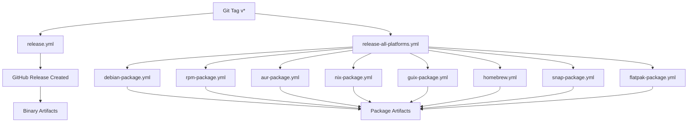

# GitHub Actions Workflows

This document describes all GitHub Actions workflows in this repository.

## Table of Contents

- [Build & Test Workflows](#build--test-workflows)
- [Release Workflows](#release-workflows)
- [Package Distribution Workflows](#package-distribution-workflows)
- [Utility Workflows](#utility-workflows)

## Build & Test Workflows

### check.yml - Build Check
**Trigger**: Push to master, Pull requests
**Purpose**: Validates code quality and build

Steps:
1. Lints code
2. Checks formatting
3. Builds project

### test-workflows.yml - Test Workflows
**Trigger**: Pull requests affecting workflows, Manual
**Purpose**: Validates workflow configurations

Steps:
1. Validates YAML syntax
2. Tests build process
3. Tests binary compilation on all platforms

### codeql.yml - CodeQL Analysis
**Trigger**: Push, Pull requests, Scheduled
**Purpose**: Security analysis

Steps:
1. Initializes CodeQL
2. Builds project
3. Performs security analysis

## Release Workflows

### release.yml - Main Release
**Trigger**: Git tags (v*), Published releases
**Purpose**: Builds binaries for all platforms and publishes to NPM

Outputs:
- Binaries for Linux (x64, arm64)
- Binaries for macOS (x64, arm64)
- Binaries for Windows (x64)
- NPM package
- All uploaded to GitHub Releases

### build-binaries.yml - Binary Builds
**Trigger**: Push to main/master, Tags, Pull requests, Manual
**Purpose**: Builds standalone binaries for all platforms

Artifacts:
- `clp-mcp-linux-x64.tar.gz`
- `clp-mcp-linux-arm64.tar.gz`
- `clp-mcp-darwin-x64.tar.gz`
- `clp-mcp-darwin-arm64.tar.gz`
- `clp-mcp-win32-x64.zip`
- `clp-mcp-npm-package.tar.gz`

### release-all-platforms.yml - Release Orchestrator
**Trigger**: Published releases, Manual
**Purpose**: Triggers all package distribution workflows

Triggers:
- Debian package build
- RPM package build
- AUR package update
- Nix package update
- Guix package update
- Homebrew formula update
- Snap package build
- Flatpak package build

## Package Distribution Workflows

### debian-package.yml - Debian/Ubuntu Package
**Trigger**: Published releases, Manual
**Purpose**: Builds .deb package

Output:
- `clp-mcp_X.Y.Z_amd64.deb`
- SHA256 checksum

Installation:
```bash
wget https://github.com/clpi/clp-mcp/releases/download/vX.Y.Z/clp-mcp_X.Y.Z_amd64.deb
sudo dpkg -i clp-mcp_X.Y.Z_amd64.deb
```

### rpm-package.yml - Fedora/RHEL Package
**Trigger**: Published releases, Manual
**Purpose**: Builds .rpm package

Output:
- `clp-mcp-X.Y.Z-1.x86_64.rpm`
- SHA256 checksum

Installation:
```bash
wget https://github.com/clpi/clp-mcp/releases/download/vX.Y.Z/clp-mcp-X.Y.Z-1.x86_64.rpm
sudo dnf install ./clp-mcp-X.Y.Z-1.x86_64.rpm
```

### aur-package.yml - Arch Linux (AUR)
**Trigger**: Published releases, Manual
**Purpose**: Generates PKGBUILD for AUR

Output:
- `aur/PKGBUILD`
- `aur/.SRCINFO`
- `aur/README.md`

Installation:
```bash
yay -S clp-mcp
# or
paru -S clp-mcp
```

### nix-package.yml - NixOS Package
**Trigger**: Published releases, Manual
**Purpose**: Creates Nix package definition

Output:
- `nix/default.nix`
- `nix/flake.nix`

Installation:
```bash
nix profile install github:clpi/clp-mcp
# or
nix-env -iA nixpkgs.clp-mcp
```

### guix-package.yml - GNU Guix Package
**Trigger**: Published releases, Manual
**Purpose**: Creates Guix package definition

Output:
- `guix/clp-mcp.scm`
- `guix/.guix-channel`

Installation:
```bash
guix install clp-mcp
# or
guix package -f clp-mcp.scm
```

### homebrew.yml - Homebrew Formula
**Trigger**: Published releases, Manual
**Purpose**: Updates Homebrew formula

Output:
- `Formula/clp-mcp.rb`

Installation:
```bash
brew tap clpi/tap
brew install clp-mcp
```

### snap-package.yml - Snap Package
**Trigger**: Published releases, Manual
**Purpose**: Builds Snap package

Output:
- `clp-mcp_X.Y.Z_amd64.snap`
- SHA256 checksum

Installation:
```bash
sudo snap install clp-mcp
# or from file
sudo snap install --dangerous clp-mcp_X.Y.Z_amd64.snap
```

### flatpak-package.yml - Flatpak Package
**Trigger**: Published releases, Manual
**Purpose**: Builds Flatpak bundle

Output:
- `clp-mcp-X.Y.Z.flatpak`
- `flatpak/com.github.clpi.clp-mcp.yml`

Installation:
```bash
flatpak install --user clp-mcp-X.Y.Z.flatpak
flatpak run com.github.clpi.clp-mcp
```

### docker-image.yml - Docker Images
**Trigger**: Push to main/master, Tags, Pull requests, Manual
**Purpose**: Builds multi-arch Docker images

Output:
- Docker Hub: `clpi/clp-mcp`
- GitHub Container Registry: `ghcr.io/clpi/clp-mcp`

Platforms:
- linux/amd64
- linux/arm64

Installation:
```bash
docker pull clpi/clp-mcp:latest
# or
docker pull ghcr.io/clpi/clp-mcp:latest
```

## Utility Workflows

### Docker Image CI
**Trigger**: Automated on push/tag
**Purpose**: Continuous Docker image builds

## Workflow Dependencies



## Manual Workflow Triggers

All workflows can be manually triggered from the Actions tab:

1. Go to https://github.com/clpi/clp-mcp/actions
2. Select the workflow
3. Click "Run workflow"
4. Enter required inputs (if any)
5. Click "Run workflow"

## Secrets Required

The following secrets should be configured in repository settings:

### Required for NPM Publishing
- `NPM_TOKEN`: NPM authentication token

### Required for Docker Hub
- `DOCKER_USERNAME`: Docker Hub username
- `DOCKER_PASSWORD`: Docker Hub password or access token

### Optional for Snap Store
- `SNAPCRAFT_TOKEN`: Snapcraft store credentials

All other workflows use the default `GITHUB_TOKEN` provided by GitHub Actions.

## Workflow Status Badges

Add these to README.md:

```markdown


```

## Troubleshooting

### Build Failures

1. Check the workflow logs in the Actions tab
2. Verify all required secrets are configured
3. Ensure dependencies are up to date
4. Test locally before pushing

### Release Issues

If a release fails:
1. Check that the tag follows semver (vX.Y.Z)
2. Verify package.json version matches
3. Ensure all required secrets are configured
4. Re-run failed jobs from the Actions tab

### Package Distribution Issues

For package-specific issues:
1. Verify the binary was built correctly
2. Check platform-specific requirements
3. Consult package manager documentation
4. Test package installation locally

## Best Practices

1. **Always test locally** before pushing workflow changes
2. **Use semantic versioning** for releases (vX.Y.Z)
3. **Update checksums** when changing binaries
4. **Document changes** in workflow files
5. **Monitor workflow runs** in the Actions tab
6. **Keep secrets secure** - never commit them to the repository

## Contributing

When adding new workflows:

1. Test thoroughly in a fork first
2. Follow existing workflow patterns
3. Add documentation to this file
4. Update DISTRIBUTION.md if adding new packages
5. Submit a pull request with description

## Release Checklist

Before creating a release:

- [ ] Update version in package.json
- [ ] Update version in src/index.ts (if applicable)
- [ ] Update CHANGELOG.md (if exists)
- [ ] Test build locally: `npm run build`
- [ ] Test binary compilation: `bun build src/index.ts --compile`
- [ ] Create and push tag: `git tag vX.Y.Z && git push origin vX.Y.Z`
- [ ] Verify release workflow completes successfully
- [ ] Check that all artifacts are uploaded
- [ ] Test installation from at least one package manager
- [ ] Update documentation if needed
